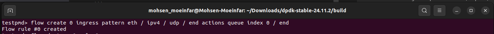
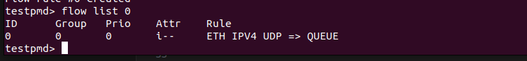
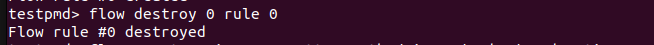
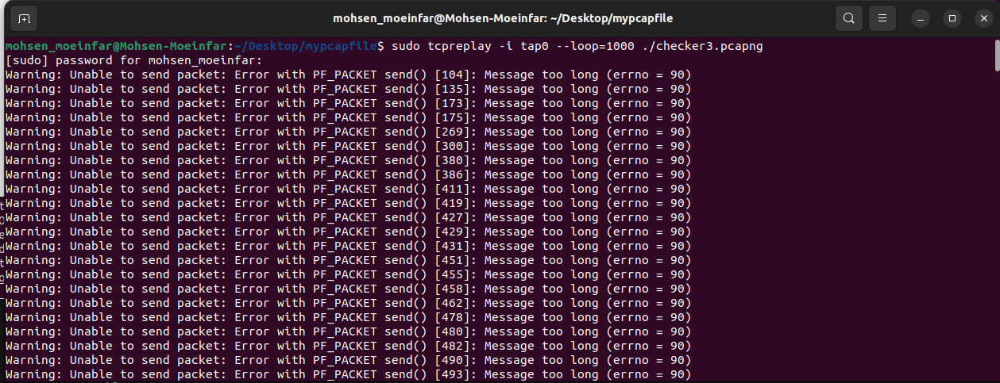
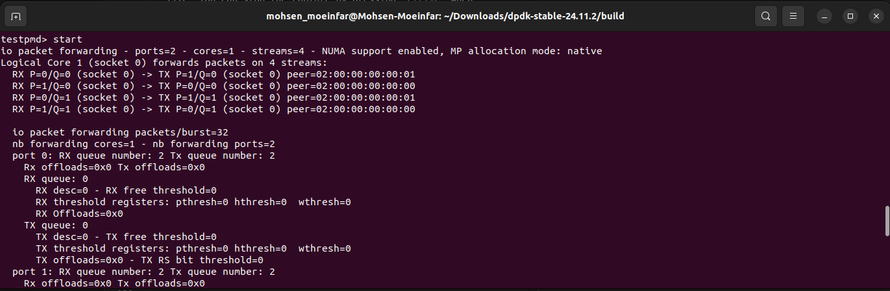
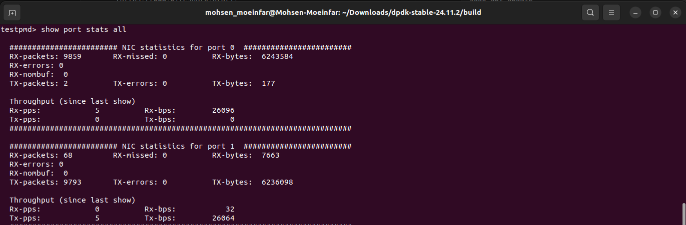
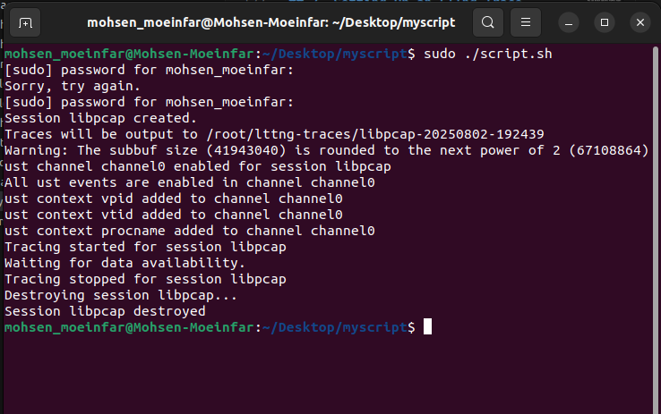

## 5. Setting Up a Flow Filtering Rule in testpmd

You can direct specific traffic types to designated queues by creating a flow filtering rule in `testpmd` using the command below.

```shell
flow create 0 ingress pattern eth / ipv4 / udp / end actions queue index 0 / end
```

Upon successful execution, the output will look similar to this:  



This rule, applied to port 0, does the following:
- Detects all incoming UDP traffic flowing over Ethernet and IPv4.
- Directs the identified packets to RX queue 0.

### Managing Active Rules

To view active rules in `testpmd`, run:  
```shell
flow list 0
```
- `0` is the port number.  

 The output will appear similar to this: 

 

### Removing a Filter

To delete a filter in `testpmd`, use:  
```shell
flow destroy 0 rule 0
```
- The first `0` is the port, the second `0` is the rule number.

The output will appear similar to this:  

  


**Note:** In this scenario, we need the filter, so removal isn't necessary. However, if we need to trace traffic without filters and accidentally set one, this command can easily remove it.


## 6. Getting Started with tcpreplay

To begin, download the tcpreplay-4.5.1.tar.gz file from the TCP-Replay repository using this link: [TCP-Replay](https://github.com/appneta/tcpreplay/releases/tag/v4.5.1). This tool helps us send traffic to one of the interfaces we’ve created using testpmd. Once you have it, you’ll need to compile and install it on your system. After that, open a new terminal window and run these commands one by one:

```shell
./configure --disable-tuntap
make
sudo make install
```

**Important Tip:**  
You might run into issues compiling tcpreplay if you don’t have the right build tools, like make or automake. If that happens you can fix this by installing them with these commands:

```shell
sudo apt update
sudo apt install build-essential automake
```

### What Does tcpreplay Do?
tcpreplay replays captured network traffic (like pcap files) through a network interface to simulate real network activity. It's useful for simulating traffic scenarios.

### Running tcpreplay
After installing tcpreplay, you can use it to play a pcap file you’ve already created. Here’s the command to do that:

```shell
tcpreplay -i tap0 --loop=1000 ./Capture.pcap
```

- `-i tap0`: This tells tcpreplay to send the traffic through the `tap0` interface.
- `--loop=1000`: This makes it repeat the pcap file 1000 times, which is great for testing under repeated conditions.
- `./Capture.pcap`: This is the name of your pcap file that contains the captured traffic you want to replay.





**Note:**
If you don't have a `pcap` file to replay, you can capture network traffic using tools like `tcpdump` or `Wireshark`.

### Capturing Traffic with tcpdump:

To install `tcpdump` and capture network traffic, follow these steps:

1. Install `tcpdump`:

   ```shell
   sudo apt update
   sudo apt install tcpdump
   ```

2. Capture traffic from your main network interface :

   ```shell
   sudo tcpdump -i wlp3s0 -w Capture.pcap
   ```

   This command will capture traffic from  wireless interface (`wlp3s0`) and save it in the `Capture.pcap` file. You can stop the capture by pressing `Ctrl+C` when you're done.

### Capturing Traffic with Wireshark:

Wireshark is a graphical tool for capturing and analyzing network traffic. You can download and install Wireshark from the official website here: [Wireshark Download](https://www.wireshark.org/).

1. Install Wireshark:

   ```shell
   sudo apt update
   sudo apt install wireshark
   ```

2. Launch Wireshark and start capturing on your desired network interface. Once you've captured the traffic, save it as a `pcap` file, and you can use that file with `tcpreplay`.


After that, in the ‍‍`testpmd` terminal, just type `start`, and then run `show port stats all` to see the traffic on the TAP interface.


<br><br>



## 7. Setting Up an LTTng Trace Session

To automate the LTTng capture process, you'll need to create a shell script that configures the LTTng session. This script will set up the session, enable the necessary context, start tracing, pause for a defined period, and then stop and clean up the session.

1. First, create a new script file and make it executable:

    ```shell
    touch script.sh
    chmod +x script.sh
    nano script.sh
    ```

2. Now, paste the following commands into your script:

    ```shell
    #!/bin/bash
    lttng create libpcap
    lttng enable-channel --userspace --num-subbuf=4 --subbuf-size=40M channel0
    #lttng enable-channel --userspace channel0
    lttng enable-event --channel channel0 --userspace --all
    lttng add-context --channel channel0 --userspace --type=vpid --type=vtid --type=procname
    lttng start
    sleep 2
    lttng stop
    lttng destroy
    ```


### Understanding the Script:


1. **Initialize the LTTng Session:**

   ```shell
   lttng create libpcap
   ```

   * Creates a new trace session named `libpcap`.

2. **Enable a Trace Channel:**

   ```shell
   lttng enable-channel --userspace --num-subbuf=4 --subbuf-size=40M channel0
   ```

   * Sets up a userspace channel (`channel0`) with 4 subbuffers, each 40MB in size, to store trace data.

4. **Enable All Trace Events:**

   ```shell
   lttng enable-event --channel channel0 --userspace --all
   ```

   * Enables all userspace events on `channel0` to be traced.

5. **Add Context Information:**

   ```shell
   lttng add-context --channel channel0 --userspace --type=vpid --type=vtid --type=procname
   ```

   * Adds context information such as the process ID (vpid), thread ID (vtid), and process name to the trace.

6. **Start the Trace:**

   ```shell
   lttng start
   ```

   * Starts the tracing session.

7. **Pause the Script:**

   ```shell
   sleep 2
   ```

   * Pauses the script for 2 seconds to allow some events to be captured.

8. **Stop and Clean Up:**

   ```shell
   lttng stop
   lttng destroy
   ```

   * Stops the trace and destroys the session, cleaning up any resources used.


### Running the Script


Once `tcpreplay` is running and generating traffic, you can execute the script by running the following command:

```shell
sudo ./script.sh
```

This will start the LTTng trace session, capturing the relevant events while `tcpreplay` continues to generate traffic.




### Viewing the Trace Results

After running the script, the trace results will be saved in the following directory:

```
/root/lttng-traces/
```

To analyze the results, you can open the trace with **Trace Compass**, a graphical tool for visualizing traces.


